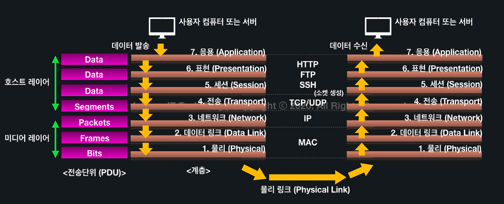

# 🎯 학습한 내용

## 클라이언트와 서버

- **클라이언트**: 서버에게 요청하는 컴퓨터, 브라우저 등 앱
- **서버**: 클라이언트의 요청에 응답을 해주는 컴퓨터 또는 프로그램
    

---

## DNS

> 인터넷 **도메인 이름을 IP 주소로 변환**하는 시스템

예를 들어, www.google.com의 IP 주소는 `142.250.196.110`, 따라서 브라우저에서 https://142.250.196.110 를 입력하여 www.google.com에 접속할 수 있다.

이때 `DNS(Domain Name System)`가 도메인 이름과 IP 주소 사이의 변환을 관리한다.

  

---

## OSI 7계층

> **네트워크 통신**이 일어나는 일련의 과정들을 7단계로 나눈 것

 

 

1️⃣ **물리 계층 (Physical Layer)**

- 전기적 신호가 나가는 **물리적인 장비**
- 전송하려는(받으려는) 데이터가 무엇인지, 어떤 에러가 있는지 등에 대해서는 신경쓰지 않는다.

2️⃣ **데이터 링크 계층 (Data Link Layer)**

- 물리계층을 통해 송수신되는 **정보의 오류와 흐름을 관리**하여 안전한 정보 전달

3️⃣ **네트워크 계층 (Network Layer)**

- 경로(Route)와 주소(IP)를 정하고 패킷을 전달해주는 것(**라우팅**)

4️⃣ **전송 계층 (Transport Layer)**

- 양 끝단의 사용자들 간의 신뢰성있는 데이터를 주고 받게 해주는 역할
- **TCP와 UDP**
  
5️⃣ **세션 계층(Session layer)**

- TCP/IP 세션을 만들고 없애는 역할

6️⃣ **표현 계층(Presentation layer)**

- **데이터의 암호화, 복호화, 압축**

7️⃣ **응용 계층(Application layer)**

- 우리가 사용하는 응용 서비스나 프로세스
-  **HTTP, FTP**
  
  
