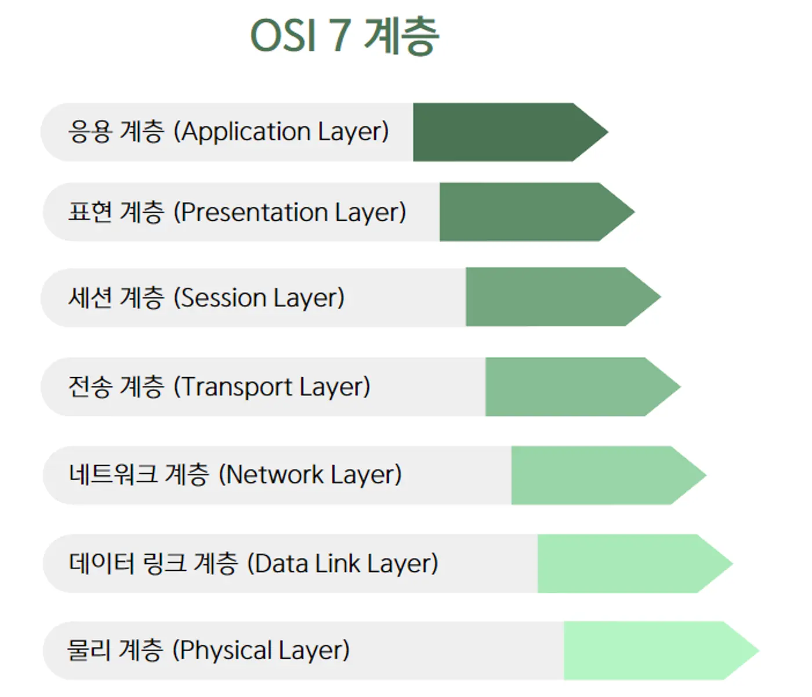

# 🎯 학습한 내용

## 클라이언트와 서버

- **클라이언트**: 서버에게 요청하는 컴퓨터, 브라우저 등 앱
- **서버**: 클라이언트의 요청에 응답을 해주는 컴퓨터 또는 프로그램
    

---

## DNS

> 인터넷 **도메인 이름을 IP 주소로 변환**하는 시스템

예를 들어, www.google.com의 IP 주소는 `142.250.196.110`, 따라서 브라우저에서 https://142.250.196.110 를 입력하여 www.google.com에 접속할 수 있다.

이때 `DNS(Domain Name System)`가 도메인 이름과 IP 주소 사이의 변환을 관리한다.

  

---

## OSI 7계층

> **네트워크 통신**이 일어나는 일련의 과정들을 7단계로 나눈 것

1️⃣ **물리 계층 (Physical Layer)**

- 한 번에 **프로세스 하나만 해당 자원을 사용할 수 있음**
- 사용 중인 자원을 다른 프로세스가 사용하려면 해제될 때까지 기다려야 함

2️⃣ **데이터 링크 계층 (Data Link Layer)**

- 프로세스가 **이미 할당된 자원을 점유한 상태에서** 추가적인 자원이 해제되기를 기다리는 상태

3️⃣ **네트워크 계층 (Network Layer)**

- 이미 할당된 자원을 **강제로 빼앗을 수 없음**

4️⃣ **전송 계층 (Transport Layer)**

- 대기 중인 프로세스들이 **순환 형태로 자원을 대기**하고 있어야 함
- (예제)
  - 프로세스 A가 자원 X를 점유하고 자원 Y를 기다림
  - 프로세스 B가 자원 Y를 점유하고 자원 Z를 기다림
  - 프로세스 C가 자원 Z를 점유하고 자원 X를 기다림
  - **A → B → C → A** 형태의 **순환 대기 발생 → 데드락!**

  
